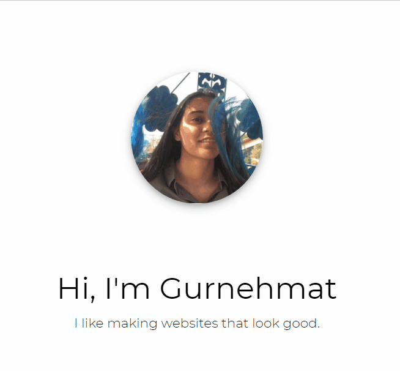

 
 
🌐  I’m currently learning web development and UI/UX  
✅  I’m looking to collaborate on anything fun (that requires a front end developer :3)  
💛  I’m looking for help with back end development  
🤹‍♀️  Pronouns: She/Her 
 

### Reach out to me

 
 

 
 
🥓 Bye. 

